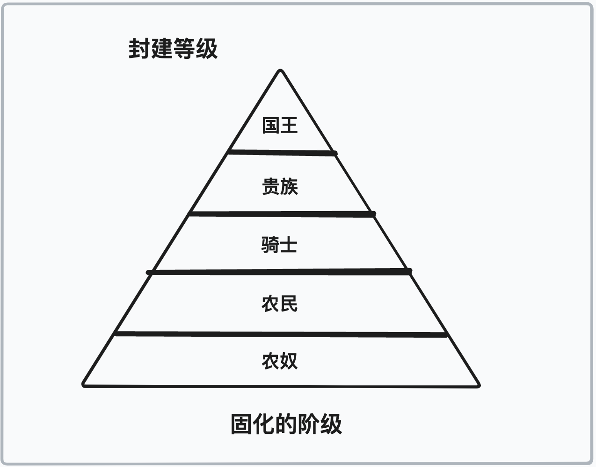
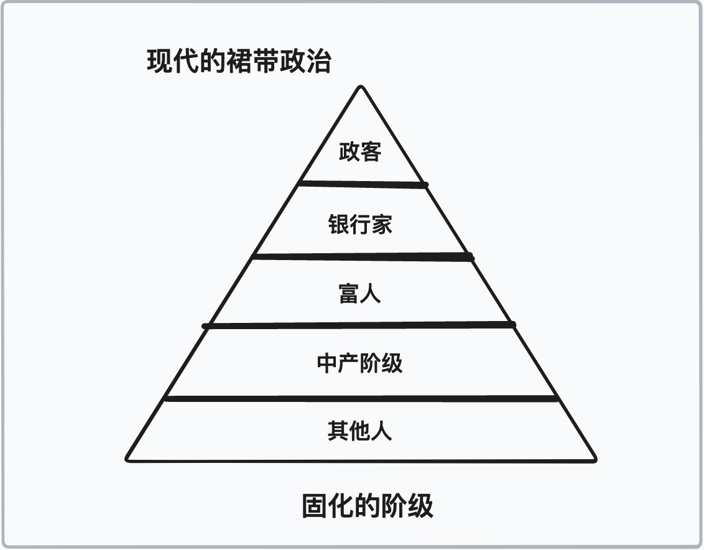
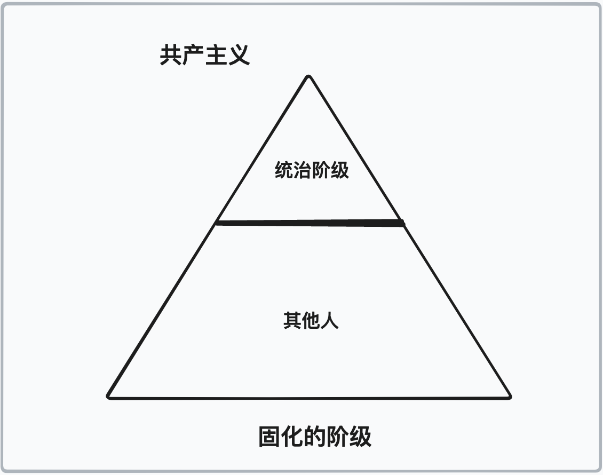
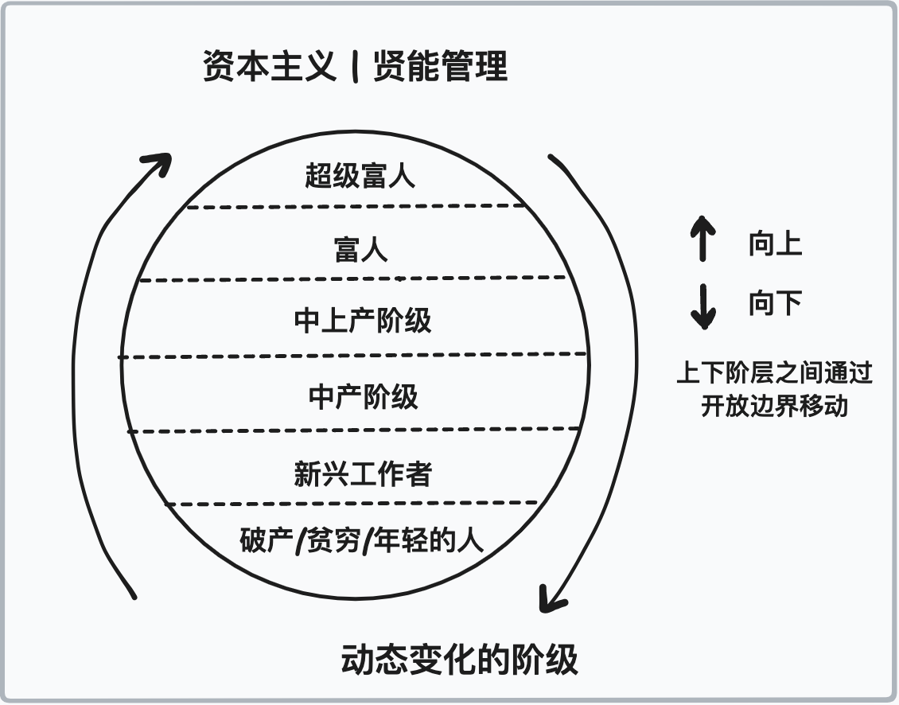

# 第一章：静态和动态的阶级

迄今为止存在的社会的历史就是斗争、适应、创新和创造性破坏的历史。

虽然这种情况有时候演变成种姓和阶级斗争，但这只是更广泛的“斗争”画卷中的一个方面。

所有的男人和女人，不论是自由人、奴隶、手艺人或经理人、企业家、艺术家、贵族、基督徒、穆斯林、巫师、僧侣、亚洲人、欧洲人、美洲人、平民、领主、农奴、行会大师、国王、贵族、战士、将军或士兵，总会在某个阶段互相对抗，也同时肩并肩地站在一起。

人类部落、文化和集体的动态涌现，其中相互竞争与互补的模型或哲学理念进行较量，以探寻如何在往往严酷的世界中最好地应对匮乏的现实，这使得个体总是有选择合作、竞争或压迫的权利。

历史告诉我们，人类在彼此相处和获取财富方面有两种选择，分别是经济手段和政治手段，就像弗朗茨·奥本海默所说的那样：

1. 经济方式涉及到私人个体的私有财产、商品和服务的生产与交换。这是自愿交换的互惠方式。 
2. 政治方式是通过使用武力、暴力或强制手段获取商品和服务的简单方法。这是单方面没收的削减、零和方式。

这种选择的现实结果就是一个始终处于变动中的世界，一方面摇摆在有机的、涌现的个人自由的极端，另一方面则是自上而下的集体强制的极端。

个人自由以分散化的方式在众多层次和能力等级上进行组织，而集体强制则通过法令以集中化的方式进行组织，这不会导致功能性的等级，而是会导致臃肿、浪费、道德上令人反感的官僚机构。

如果我们可以将之前的所有斗争总结出一点，那就是个人为保持自治和独立而斗争，以抵抗集体利用政治力量将个体划分类别以便提取财富。是分散化还是集中化，自下而上还是自上而下，自然有机还是人为强制的。

###  社会流动性

或许人类在社会层面上最具破坏性的问题之一是阶级僵化。尽管马克思正确地指出了它们之间的压迫，但他错误地认为只有两个阶级，而且可能以某种方式将每个人压缩成“一个阶级”。

正如我们所见，这种方法不仅失败了，因为人类是多样化的，而且结果创造了两个阶级，“通过法令”，即成为“国家”的“公共代表”，聚集了所有的权力，不受指责，而私人个体，则成为国家的奴隶。

结果是它比封建制度、裙带资本主义或种姓制度更糟糕。实际上，它给我们留下了一个更加陈腐的类似种姓制度的系统。

马克思和恩格斯指出：

> 从封建社会废墟中崛起的现代资产阶级社会并未消除阶级对立。它只是建立了新的阶级，新的压迫条件，代替旧的对抗形式的新的斗争形式。

撇开武断的阶级划分不谈，这当然是真实的，并且是人类历史上斗争动态的一部分。他们的错误在于假设社会可以达到某种终点状态，趋同于马克思和恩格斯自己定义的两个阶级，而不是由其组成的个体来定义。

他们认为答案是“消灭”其中一个阶级，最终的工人阶级将达到不存在斗争的状态。他们不仅对人性一无所知，而且对生命是发现之旅和忍耐更高质量斗争的真相一无所知。找到贯穿每种学科的黄金线索，并使用一个人获得的原则来理解最好的生活方式。这个过程是一种流动性的过程。你会因为你的行动的后果而上升和下降。结果虽然不均匀分布，但在适用于所有人的规则制度中是公平的。

当社会流动性存在时，不平等并不是问题。事实上，它是理想的，因为它不仅使世界多样化，而且给了个人有意义的未来去奋斗。

马克思和其他思维僵化、实证主义的哲学家们没能认识到的是，驱动人类的首要动力不是权力意志，而是意义意志。意义需要有东西去奋斗，并且是每个人必须自己去发现的。

此外，虽然许多人希望拥有更多财富、更多资产和更多房产，但也有人希望完全相反。他们宁愿生活在没有物质约束和负担的自由中。这是马克思主义理论中展示的对人类心理缺乏理解的另一个例子。

因此，我们可以通过一些自上而下的法令来组织社会并限制权力（这总是失败的，因为指令来自于顶层，而权力也会集中在那里），或者我们可以让它自下而上地出现，个人可以发现自己的意义并努力成为最好的自己。

历史充满了各种等级制度的变化，迄今为止的共同主题是在大致静态的阶级内部存在某种形式的社会流动性，这些阶级是通过用法令或政令取代能力而随着时间的推移逐渐僵化的。

* 封建制度：固定的等级

  

* 裙带政治：固化的政治与经济

  

* 共产主义：固化的政治

  

我们提出，不通过法令，而是通过能力和自由的自然力量来转变和重组社会。

动态不平等是一种存在阶级的社会形态，但是这些阶级可以相互渗透。所有人都有机会向上攀爬，同时也有可能失败并且落回阶级体系。向上攀爬取决于工作、能力、技能、才华、毅力、欲望、意志以及运气。而向下落时则是因为浪费、糟糕的计算、错误的判断、不道德的行为、无能、懒惰以及不幸的运气造成的。

我们怎么做到这些？

第一步是停止干预。

通过这样做，个人可以掌控自己的未来，在他们选择或在自然倾向的方面成为负责任、主权、有能力的自己。

随着时间的推移，它可能会看起来像下面这样：

* 自由市场：充满活力、社会流动性。

  

> 封建的财产关系已经无法与已经发展起来的生产力相适应；它们变成了如此多的枷锁。它们必须被打破；它们被打破了。

--- 马克思和恩格斯《共产主义宣言》。

封建等级制度与能力等级制度直面对抗，结果是自然的、有机的、自由市场力量转变了以前的封建财产关系。

这显然是一种解放力量，它为所有受制于深陷陈旧、世袭的封建等级体系下的有用之人解放束缚。

这些等级制度已经在数个世纪中逐渐崛起，起源于征服、能力、勇敢、英勇和武士精神，但随着几代人的统治权被特权、迟钝、无意义和常常没用的人腐蚀了。

所谓的资产阶级崛起了，通过运用数学、金融、科学和技术，他们能够给数百万人带来繁荣，并超越他们的统治者。

他们提供了更多的价值，市场做出了选择。进化做出了选择。

当政治寄生虫开始尝试引导人类天性的自然力量（进步和创新）并将其利用于政治利益时，问题就出现了。

到这个程度，人们可以共情马克思。一群新的政治寄生虫代替了老的，但和被推翻的那些人一样糟糕。新贵们没有尊重促成他们解放的过程，反而创造了一个新的官僚垄断体系，形成了监管壕沟，不仅阻碍了进步，也扼杀了有能力的人自主崛起的机会。

### 动态不平等 Dynamic Inequality

> 没有人与任何人一样。即使是同一个人在不同的日子里也不一样。

--- 托马斯·索维尔

你不能仅仅试图提高底层人群的水平来创造动态平等（尽管这往往是徒劳的）。相反，系统必须允许富人轮换（如塔勒布的代笔人所说）。在地位方面，为了让那些在“底部”的人有可能攀升，那些在顶部的人必须有可能下降。而且为了保持有机动性，这两个可能性都不能通过强制实现，而只能通过个人“有能力”或“缺乏能力”来实现。

因此，问题不是：如何停止世界的引擎，创造一个由一个静态公共代表机构统治的静态阶层？

问题应该是：我们如何确保社会流动性和动态不平等，在这种不平等中，能力在多个阶层衡量维度方面发挥作用？

例如，我们有比特币这样的机会。历史上首次出现了向上移动的能力，因为那些“底层人士”可以正式保存和保护他们劳动的成果，向下流动性也存在，因为那些“顶层人士”不能再通过印刷新货币或将坏决策的成本转嫁给他们所“代表”的人来社会化他们的损失。

在一个有机的、资本主义的社会里，政治统治阶级不能随意地凭空创造金钱。如果你创造更多的价值，做更多的工作，提供更好的服务，制造更好的产品，或者在生活中做出更好的选择，你就会成功。如果你消费比你生产更多，浪费资源，做出糟糕的投资决策，花光所有的钱去参加派对和饮酒，那么猜猜会发生什么，你就不能再印钱或者向他人征税来弥补你的亏损。你将跌落社会阶梯。

这是公平的(fair)，结果是不平等的(unequal)。

就应该是这样。

> 真正的平等是概率上的平等。

--- 纳西姆·尼古拉斯·塔莱布

这就为能力等级的功能性、有用性、动态性的出现提供了可能。

### 有机等级 (Organic Hierarchies)

等级制度是一种自然现象，存在于所有简单、线性、特别是复杂和生活系统中。等级必然会出现，因为生命必须选择。为了做到这一点，必须进行优先排序。我们称之为等级制度。

我一点也不建议存在“一种”正确的方法。生活并不如此简单。我们生存于一个复杂的世界，其中层次和优先级方法跨越多个维度。请记住，人类是主观的、有价值取向的存在。

因此，问题不在于是否应该存在等级制度（这就像争论重力的存在一样），而在于“它以何种形式存在，对生命最有益？”

我们应该尝试建模生命与死亡谱系的哪一端？

一方面，我们有由法令所规定的等级制度。这些等级制度是不自然和自上而下强制的。它们存在于法定条款中，并且由于部分成员缺少资本参与，它们形成时会牺牲和排斥许多其他人。

另一方面，我们有自然和应运而生的那些。它们可以被归类为能力等级制度，其中的等级和地位是人们能力的自然输出和结果。参与者通常也有所担当，因此它们既更符合人体工程学，也更具动态性。

当然，在这两个极端之间，我们还有一切其他的东西。

如果现代性向我们展示了什么，那就是可能最初因能力和对秩序的渴望而出现的机构，他们通过强制形成垄断地位，不仅会开始腐朽，还会带来意想不到的后果，这些后果可能比他们之前想管理的混乱更加危险。

马克思本人注意到这种进步或资本主义是有待被纠正的，尽管他对“创造性破坏”的概念不知情。也许这是出生在那个时期的局限性的原因，或者是他的性格的一部分，但现在我们知道得更好了。

> 在这些危机中，现有的产品以及之前创造的生产力的很大一部分都会被周期性毁灭。

--- 马克思

小型的、周期性的森林火灾，有助于避免每十年一次的大规模森林灾害，因为这种灾害会破坏表层土壤。同样的，生产周期也会自然出现矫正行动。

有人可能称之为危机，但这其实是市场对于生产过剩的信号。它们就像是小的森林火灾，必须定期发生以维持整个系统的完整性。

如果没有持续的纠正，缺少必要的反馈，过度或不足的生产就会失控，导致社会崩溃或自然资源完全耗尽。我们在世界各地的中央计划和管理的国家中不断看到这种情况。

毛泽东时代中国的森林情况，例如，在环境方面发生的灾难性事件，规模巨大，但是很少有人了解。

我们甚至可以在软件行业熟悉的背景下看到这个真理的表达。瀑布式开发与敏捷开发。前者是预先计划的，后者是迭代的。前者是集中管理的，后者是在边缘上指导和调整的（分散式）。前者做出早期的假设，最终错失机会，后者不断适应、纠正和演化。

这再次反映了进步的动态性质。创新不仅通过二元的创造性毁灭不断纠正自身，而且从定义上来说，它的分布是不均衡的。

我们必须走开，停止试图从政治上和人工上控制地位。社会将通过反馈和修正、风险和回报、快乐和痛苦自然地找到自己的动态平衡，形成自己的动态等级制度。这将在每个地区里区域性的发生，因此是分散的，发生的速度也不同。这就是进步。

### 不平等的进步 > 平等的破坏

熵是一种强大的力量，随着时间的推移削弱了人体，冷却热水，并将所有的“多数统治”转变为向下螺旋的“最低公共分母的暴政”。(Entropy is the overwhelming force that breaks the human body down over time, cools hot water and turns all ‘governments of the majority’ into a downward spiraling ‘tyranny of the lowest common denominator’.)

生命是逐步发展的力量，可扭转熵增趋势，而每个人都能发挥这种力量。由于其速率、力度和能量不同，生命的发展不是平等的。因此，进步是不平均的。

然而，破坏可以更加均匀地应用和执行。将某人拉下来总是比提拔他们更容易。破坏总是比建设容易。因此，政治总是受到熵的趋势的影响。

那些有生命、有呼吸的个体能够对抗熵。他们能够以不同的速度、出于不同的原因，在不同的维度上成长、扩展和演化。他们可以被推向更美好的未来，也可以被逼离糟糕的过去。

想象中的集体主义没有灵魂、身体或思想，也不能抵御熵增。随着规模增长，它的完整性降低，扩张则使它僵化并变得更加脆弱。

成长，进步，演化和创新是个人的领域。

没有一条路是笔直的，沿途会有创造性的破坏、胜者和失败者、相互作用和矫正，但这就是生命的美丽所在。

马克思观察到：“制造业的位置被现代工业巨头取代；工业中产阶层的位置被工业百万富翁所代替，他们是整个工业军队的领袖，也是现代资产阶级的代表。”

他再次将其打造成负面形象，仿佛这个资产阶级的最后崛起是最终状态。

事实上，马克思主义和卢德主义思想似乎存在着类似的缺陷，即他们认为进步有某种上限，或者某种最终的、静态的阶级结构将会出现，除非被工人阶级推翻，否则永远无法改变。

因此，他们天真地建议我们停止一切进步，使每个人平等，平均分配所有资源，仿佛生活和社会可以保持静止，或者一个人的问题仅仅是他的物质财富的函数。这显示了对人类心理和人类精神的极度缺乏理解（它们总会不断发展），以及对人类通过个体的实验和创新能力达到新高度的能力的完全缺乏信心。

马克思主义者和卢德主义者的目标太低了，他们完全忽视了人类的真正潜力。因为害怕和缺乏，他们选择建立官僚机构来保护（和削弱）迄今为止所积累的资本。反过来，他们扼杀了人类精神并抑制了其达成愿望的欲望。

这是一种悲观、虚无主义和狭隘的人类观，导致人们的高时间偏好，行为不谨慎，并持续地侵蚀了珍贵的资本。

### 创新胜过垄断

请问一个普通人垄断产生的原因，他们可能会盲目地说“资本主义”。如果我们要作为一个物种前进，就必须处理和驳斥这种错误观念。垄断企业无法自然地产生或保持稳定，只能通过法令存在。

马克思指出（与他先前的断言相矛盾）：“资产阶级用来推翻封建主义的武器现在反过来对付资产阶级自己。”

有趣的是，他是对的，但再次不是他所想的原因。

数学，科学，金钱和自由市场的武器不仅让那些使用它们的人负责，也同样能打击那些无视它们的人。这是自然法则和秩序。这维持了系统的稳定和活力，这也是我们所追寻的。

你可能会说：“噢，这对你来说很容易，但如果不加限制，那些贪婪的资本家、工业家、技术专家，以及其他的一些人，将会获取所有可用的资本，而我们会成为他们的奴隶。”

相信事情可能是这样的是误解生命的动态本质、创新的核心原则以及规模问题，即随着事物的变大，它变得越来越不灵活和适应。

创新是创造与破坏的共生，通向更高效率和效能的道路。敏捷、更新、纠正和重新发掘是其基因，完美体现在前面所描述的“敏捷”与“瀑布”开发方式之间的差异，或者甚至在游击战中。

必须明确简洁地表明，无限制的资本主义无法导致长期的集中、集权或垄断，因为自由市场的竞争性质意味着更小、更灵活、更敏捷的玩家集体拥有更多的智慧、力量、能力和能力。

相信仅靠规模或铸币收益就能击败创新，也相信一个大公司可以聚集所有财富，就是忽视了苹果超越IBM，Facebook主宰MySpace，Netflix取代Blockbuster，特斯拉击败通用汽车，十年技术公司的市值超过一百年石油公司，以及比特币自创始以来对美元增长了1亿倍的事实。

事实上，即使情况对他不利，大卫总是能打败戈利亚。（译者注：源自圣经。戈利亚是身穿盔甲的高大勇猛战士，大卫是只用石子和牧羊杖的牧童。敏捷的大卫打败了戈利亚。）

当今世界以裙带关系运作，并受到坎蒂隆效应的影响。政府制定法规，保护其企业合作伙伴免受竞争的影响，而他们离发行货币很近，这导致他们积累更多的财富，这是以牺牲社会中的有生产力的成员为代价的。

因此，他们真正玩的游戏是“正面我赢，反面你输”。

但是尽管存在这种优势，大型企业合作伙伴仍然不敌更小、更灵活、更新颖、更敏捷和更有创新力的竞争对手。

如果我们能打破裙带关系的壁垒，在决策制定中重新引入经济后果（宏观和微观），并允许个体之间的自由、自愿交易，也许我们可以为每个人创造一个更具活力的世界，让最有能力的人提升所有人的生活质量。

这就是让人类精神追求星辰时所拥有的力量。

也许这将实现马克思似乎更为可口的愿望之一，即大师和工匠的崛起和解救。

### 大师与工匠

马克思指出：

> 现代工业已将家族主人的小作坊转变为工业资本家的大工厂。成群的劳动者挤在工厂里，像士兵一样组织。作为工业军队的普通士兵，他们被安排在一个完美的军官和中士的等级制度下。

有一段时间，他是对的。随着人类走出战壕、农场和封建等级制度下的贫民窟，系统化和集中化的过程也随之发生。

但正如早先提到的，甚至是马克思本人所说，资产阶级使用的武器会反过来针对他们。一方面，竞争将劳动商品化，但另一方面，新技术、产品、服务和产业出现了，随之而来的是新的维度和才华、技能和能力的需求开始将总体劳动价格向上推高。

当然这并不是指所有的劳动，但对于大多数劳动来说是正确的。起初，随着竞争的加剧，非熟练工人有机会成为熟练工人，这反过来又造成了非熟练工人短缺的局面，最终导致了更多工人争夺更少的工作机会，或是强制推动机器和自动化流程的发展，让非熟练工人的角色逐渐被淘汰。

通过自动化导致过时并不是“坏事”，正如鲁德派和新鲁德派慢慢领会的那样。因为总体而言，它创造了上升的机会，并将马克思主义者抱怨的单调、毫无意义的工作交给机器和自动化来处理。

这样一来，人类就可以创造更多的财富，减少人工劳动的投入。人们可以通过机智和创新来不断升级马斯洛的需要层次，而不是受到某个委员会的伪命令。人们又能获得成为艺术家、工匠和大师的空间。正如我们所见，科技和信息的进步创造了全新的资本、商品和服务形式，包括内容创作者、软件开发人员、YouTube明星和平面设计师等等。

与马克思所说的相反：

> 中产阶级底层——小商贩、店主、退休手工业者、手工艺工人和农民，都下沉到一些的无产阶级中，无法通过创新和自愿行动与大资本家竞争。我们之前曾有机会向上层流动。

就像设计中的双钻模型一样，人类必须经历了一段集中化和废品劳动力过度期才能摆脱贫困。

把马克思和卢德派之前的人都当作是“时代的裨益”来考虑，这一时期肯定是前所未有的艰难困苦。但是，千里之行始于足下，最初的几步总是最艰难的。阻止这个过程从来不是答案，也永远不会是答案。让它自己走吧，不要去阻止干预它。

> 如果你正在经历狱炎，继续前行。

--- 丘吉尔

所有人都需要在吃鱼子酱之前吃过一次屎，这是必须经历的仪式。除非你很幸运或者你有特权，能在自由市场中立刻享用鱼子酱，但你也可能在未来的某一天回到吃屎的时候。

它让我想起了埃德蒙·唐泰斯成为《基督山伯爵》之前的一句话。当他的老师“牧师”问他如何定义经济学时，他简略地回答道：“现在挖掘，以后赚钱。”

这是先种后收的法则，或者说是先生产后消耗的现实。这是自然先验法则，人类集体必须从无到有地走过。这个旅程在定义上会很艰辛、肮脏，并会遭遇挫折，但这是必需的，从我们的立场来看，这是值得的。