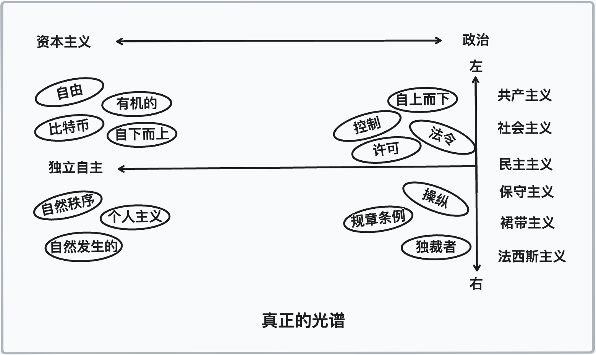
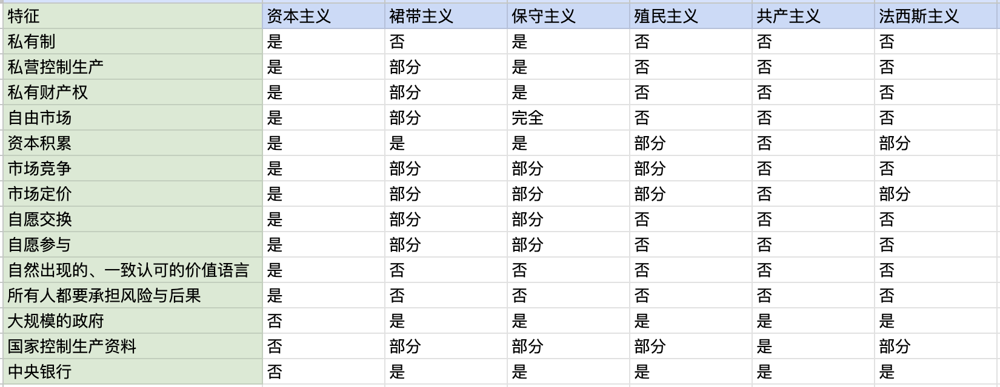

# 第三章：资本主义的幽灵变种

### 资本主义的堕落

> 摧毁资本主义制度的最佳方式是破坏货币价值。通过不断的通货膨胀，政府可以隐蔽地没收公民的财富。这种方式不仅没收了大部分财富，还是任意的没收；而且，虽然这个过程会让许多人贫穷，但也会让一些人变得富有。
>
> 随着通货膨胀的进行和货币的实际价值在一个月内剧烈波动，所有债务人和债权人之间的关系构成了资本主义的最终基础，变得如此混乱以至于几乎没有意义; 而致富的过程退化成一场赌博和彩票。

--- 列宁同志

在乔治·奥威尔的经典著作《1984》中，他引入了诸如“新话”和“双重思想”等术语。这些是特别设计的手段，通过限制词汇、扭曲定义（“自由就是奴隶”，“战争就是和平”）和残酷的监视系统来控制人口的思维过程。它们的目的是防止复杂思维或表达任何不符合极权政府正统的概念。将复杂的人类转化为简单的数据库条目。

不幸的是，他的书似乎被现代政府用作模板，而不是作为警示，这为我们带来反乌托邦式的乌托邦。

在过去的24个月中，这一点对于思想自由的个人来说变得更加明显。我们现在有事实核查员、真相部、‘健康’营、内容警察、大规模审查、定义失真、认可言论、语言卫生和不断涌现的相对主义宣传，这些只会让所有人感到困惑和狂怒。

像资本主义和精英这样的词已经完全失去了它们的意义，让人们想到了“垄断、剥削和政客”，而实际上它们的意思截然不同。反之亦然。当你听到进步派谈论“教育”时，往往意味着“灌输”，而“言论自由”常常意味着“经过批准的言论”。

这就是为什么我们感觉重要的是从一套定义开始写这本书。为了查明真相，我们必须以客观标准为基础。

因此，让我们把注意力转向马克思所使用的一个词语，也经常被视为共产主义的对立政治制度：资本主义。

我们认为，资本主义与任何形式的政治都没有共同点或共同方向。正如在开头定义中所讨论的，资本主义是一个非政治性的有机过程，因此它存在于政治秩序无关的环境中。在那些完全由上层控制的领土中，它被称为“黑市”，甚至是农民和工匠之间的易货贸易；而在相对自由和开放的领土中，它则体现为私人个体和/或企业之间的贸易。

问题一直以来都是，将政治形式投射到这个有机过程中。让我们通过回顾一些最常见的观念并将它们与“资本主义”和“自由市场”分开来，来消除这些观念。

> 知识自由离不开政治自由；政治自由离不开经济自由；自由的思想和自由的市场是相辅相成的。

--- 安·兰德

###  裙带主义

资本主义最常被认为的现代政治模式是裙带资本主义。

如果你问大多数人对资本主义的定义，他们很可能会列出特权资本主义政治体系的特点。常常被称为“裙带资本主义”。

裙带资本主义发生在私人实体使用公共机构来改变规则，并给自己特殊权利或特权时。换句话说，政治家和政府有动力给特定企业和行业不公平的优势，因为作为“人民代表”，他们有垄断权利这样做。

在这种环境下，一些公司能够脱颖而出并获得不成比例的财富，这是因为它们并非在一个公平的竞争场上进行。它们不是通过努力具备竞争力和创新能力，而是通过利用和剥削政府授予的监管渠道、保护主义和纾困资金来获得繁荣，这给付了纳税人或国家货币持有者们不断的风险。

这正是“道德风险”的定义。

这与原始的自然资本主义背道而驰。如果你跳下悬崖，你很可能会死，你不能指望没有跳下悬崖的人替你而死。同样，你不能指望别人替你去健身房减肥。

在裙带资本主义的情况下，一个群体做出的错误决策由另一个群体承担，而这个群体既不知情，也没有被征得使用他们资源的许可。

原始资本主义需要纠正、冒险和创造性毁灭。回报只能以冒险为代价获得，为了降低这个代价，必须消除风险（例如，选择不从悬崖跳下），而不是将风险重新定价并转嫁由其他没有得到他们同意的人承担。

这就是为什么裙带资本主义往往是最容易让有机资本主义声名狼藉的政治化身。

拥有暴力使用、货币发行、立法和监管的垄断权的“国家”的存在，意味着存在向党派政治和贸易保护主义的倾向，导致市场自由化程度的下降。国家垄断会始终倾向于规章制度、优越条件、新法规和通过发行新货币社会化风险，进而贬值所有持有该货币的人的储蓄。

这种资本主义的丑恶变态及其与“商业”的联系是为什么普通人得出结论说比赛受到了操纵。他们的直觉是正确的，但他们攻击的目标不对。

我们打算纠正这一目标，并将他们的挫折感引导到真正有意义的地方。

为此，我们将像马克思和恩格斯一样，给伪装成资本主义的裙带资本主义增添几分颜色。

### 中央银行和银行垄断组织

2008年的金融危机是由银行创造了一系列危险的金融产品，并使用杠杆引发而来。这些金融衍生品，特别是抵押贷款相关的CDO（抵押债务证券）和CDS（信用违约掉期），被用作重新定价金融风险并将其隐藏起来的方式。

结果是，一开始就像有人得到了一台印钞机，突然间创造了很多财富。他们像伊卡洛斯一样高飞，带着羽毛薄膜的翅膀。然而随着故事的进展，这种欺诈行为终结了，风险的代价变得不堪承受，其后果几乎使整个复杂、相互关联的全球市场陷入瘫痪。

随着事情的崩溃，银行集团将政府官员（即您的代表）和央行家聚集在一间房间里，以“解决他们创造的问题”。他们利用这种“接近性”来修改现有法律，保护自己的利益，并用纳税人保证的资金（政府支持）和一系列货币政策计划来掩盖损失。迄今为止，这些政策计划只不断膨胀、加速和贬值货币，从而贬值了任何被迫以此“货币”交换时间和精力的人的财富。换句话说，他们引起问题，他们获得收益，当问题倒塌时，您为损失买单。道德风险（译者注：指在一方面采取行动时，由于另一方面承担了风险，因此可能会导致不道德的行为）。

最后，没有人承担责任，银行进行了重组，十年后它们不仅更富有、更强大，而且与金融市场更为密切联系，而且它们正在再次做同样的事情。新的衍生品，以新的名称出现，知道如果出了问题，它们的损失再一次将被社会平摊。

在自由市场受到原始资本主义的制约下，这些银行不仅不可能在一开始就变得如此庞大，而且任何此类行为最终都将导致失败。没有政府可以获取监管方面的好处，也没有中央银行可以救助它们。在它们的废墟中，新的、更明智、更负责任的资金管理者和地方银行会出现。

也许在足够长的时间尺度上，他们的欺诈行为可能是人类必须付出的代价，这样人们才能发现比特币。

### 技术官僚政体

技术官僚主义试图用更能准确定义和预测问题、并提出解决方案的算法和技术，来替代中央规划者的糟糕决策。

我们再次看到人们想要用一些经验主义、中央强制的模型来替代由多元化个体完成的整体性新兴思维，这些模型假定人类可以归纳为数字，我们的行动可以化作等式。

对道德和亲情的信仰被替换成对专家和国家“科学”的信仰。大型科技公司成为了工具，审查成为常态，监视无处不在，是否能接入和访问取决于社会信用评分。

不需要提醒任何人这个现实。只需要在谷歌上搜索“大规模集体妄想症” (Mass Formation Psychosis)，就可以让人们自己发现真相。

这种工具性的、冷漠的裙带资本主义再次远离了自然、有机的资本主义，就像把土豆和火箭船相比较一样。与之前描述的政治-银行联盟模式唯一的区别是，红色幕布背后的中央计划者被键盘背后的中央计划者所取代，而银行则被上市的科技公司取代。

事实上，技术专家的最终目标是通过人工智能为政府和中央发行加密货币为货币，从而将所有生活纳入数字万有引力和控制之下。

又一次的，在这个黯淡未来的路口，比特币站了出来。我们只能希望我们能及时醒悟。

### 垄断

资本主义最常见的批评之一是，如果不加限制，权力和财富会集中在少数人手中，并随后形成垄断。他们认为，在自由市场环境中，主导企业可以击败竞争对手，一旦竞争对手被淘汰，垄断企业会提高次品商品和服务的价格。

我们在宣言中早就消除了这种观念，表明创新的优越性胜过规模。

垄断无法在竞争自由的环境中存在。如果可以，自然界中的自由竞争将只在每个大陆上留下一个品种。其他所有物种都已被消灭。

这不是复杂系统与不同实体和独特个体运作的方式。它们是相互依存的，创造性破坏的过程将带来新的竞争、进步和增长维度，伴随着新的机遇。

看起来像垄断可能会持续一段时间，实际上，通过接触到最终垄断的源头（国家），它们可以通过监管护城河、保护主义和接近货币策划来延长其寿命 - 我们今天在银行、制药公司、能源公司等领域看到了这一点。进入障碍非常高，创新受到了压制 - 但最终，它们也会屈服于创新和进步的压倒性力量。

亚马逊是一个很好的例子，虽然在其背后创造了巨大的繁荣，亚马逊最初是一家创新型公司，通过在市场上竞争取得成功，但随着时间的推移，亚马逊因央行创造的宽松货币政策、过热的股票市场估值以及优惠的信贷市场而变成了一只庞然大物，使其能够在数十年的时间里亏损经营，同时独吞世界各地的小零售商，这些小零售商无法在不生产利润的情况下保持营业。

此外，荒谬的政府封锁令和强制命令，以及企业受惠的规定，使得它成为近代史上最困难的经济时期之一中却能够蓬勃发展的企业之一。所有这一切，都是上游垄断企业可以将其糟糕的决策成本转嫁给民众的结果，而这并没有得到民众的同意。

我们所要面对的是和“利维坦”的斗争，这种斗争不能靠一个新的政治力量，而是需要通过创新、私有财产、责任和自由贸易。把这些联合在一起，自由的优点便无法被打败，因为每隔一段时间，就会出现一些突破性的进展，无论多少保护主义或监管优势都无法保护“利维坦”。

我们认为比特币是那种0到1的时刻，不仅仅是针对货币，而是针对整个社会的组织方式。这不仅会影响银行和支付行业，更会影响中央计划、中央银行和国家体系的打破和重构。

### 寡头垄断

寡头垄断是垄断的延伸，只是存在于虚假竞争的垄断集团。它们与上述任何组织没有区别，只是像一个有多个头的国家附属机构那样运作。

它们有多种形式，包括银行垄断集团、化学垄断集团、大型制药公司和大规模技术公司。

我们无需再深入讨论这一点，只需明确指出，这既不是资本主义的形式，也不等同于竞争为王的自由市场。

### 政治资本主义

一个完全错误的名称，这是一种无法存在的东西。

为了走向一个让每个人都能主宰自己命运的世界，我们必须让政治与经济分开，同时让国家与货币分离。

### 保守主义 / 右派

许多人今天认为保守派、共和党或“右派”在某种程度上代表资本主义。

事实是，有机资本主义进程如果需要一些官僚来代表它，就像海洋需要你用手形成波浪一样。

共和党在裙带政治方面是最早的匪帮。他们撰写了手册。之后，自由派将事情推向了另一个高度。

资本主义不是一种政治哲学，也不是左翼或右翼意识形态。

这是所有人在把混沌变为秩序的过程中自然发生的过程。

保守派（Conservatives）不一定与右翼政治家相同，通常倾向于承认长期存在、适于当前的启发式方法来组织社会。因此，他们倾向于更多地让资本主义进程自行发展，而进步主义者（progressives）则认为我们需要管理一切。

共和党人，不一定是保守派，认为政治高于经济，因此利用自己的职位获得利益，常常以代表他们所称的人为代价。

如您所见，我们提出了一个新的轴心，并且倾向于消除大规模的群众代表，支持当地的决策权及自由。

### 民主主义

民主制度没有被视为从自由市场的繁荣中受益，继续吸取资源、资本、能力和能源的寄生虫，反而被认为是繁荣和自由市场的起源。

这与事实相去甚远。首先，自愿交换早在这种“民主”出现之前就已存在，并且在它消失后仍将存在。其次，更重要的是，所有进步的基础是生产力、创新和交换，而不是政治统治。

人类的进化不是因为政治的束缚而发生的，恰恰是尽管受到这些束缚，但依然得以发生的。

人类繁荣与进步的源泉一直都是自由且自愿的私人交流，这些私人相互尊重私有财产权，并利用个人创意变得更加有用和富有成效。

事实上，它被混淆为“民主的制度”是现代社会最大的谬误之一。

对于在古雅典城邦中写作的希腊人来说，民主只不过是暴民统治。这是群众政治。煽动家会使用低级的献媚和恐惧来引导公众舆论朝着他们希望的方向发展。

柏拉图认为，纯粹的民主总是有可能变为暴政的一步之遥，因为能够巧妙操作民众的人可以在受到流行的称赞的推动下掌握权力，然后将自己变成暴君。

民主制度对资本主义是一种侮辱，因为自然界不认可政治。唯一重要的投票方式是你选择花费以及使用自己劳动成果来投票。换句话说，你通过你的劳动和你的金钱投票。

试图混淆该过程并在之间加入一系列决策层，使代表可以代表既想要又不想要被代表的人做出不负责任的经济决策不仅是可鄙的，而且低效和无效。因此，这直接违反了资本主义的强驱动力！

当民主与任何形式的裙带关系结合时，是最危险的，因为生产力不足的大多数人总是希望通过生产力较高的少数人支付更多的利益来投票。因此产生了现代性。

### 殖民主义

殖民主义是一种实践或政策，指一个民族或实力通过建立殖民地等方式对另一个领土实行控制，通常旨在实现经济优势。许多人被教导认为资本主义导致了殖民主义，因此认为它们是一回事，但是如果我们从它们的最基本层面来看，可以看出并不是这样。

资本主义的中心特征包括竞争市场、私有财产权、自愿交易、创新和贸易。

殖民主义是一种统治的实践，涉及将一个民族征服另一个民族，关心的往往不是贸易，而是武力、强制和往往是没收。

资本主义尊重私有财产，殖民主义则剥夺之。

资本主义需要自愿交易，殖民主义则是一种民族对另一民族的统治。

混淆这两个概念对任何人都没有好处，只会让人们倾向于报复或意气用事。

### 资本主义：一个新的坐标轴

上述各种非资本主义版本仅仅是集体主义的形式。事实上，我们写下这些文字的一部分原因是为了帮助读者重新调整自己的坐标轴。

资本主义既不属于右派也不属于左派，与政治无关。

正如我们所注意到的那样，资本主义是一种有机自然的“存在方式”。按定义，所有生物都通过获取稀缺的资源、时间和能量（资本），并将它们转化为高度有生命力或价值的东西来进化和成长。

人性的谱系并不是“左右”政治，而是资本主义在一端，政治在另一端，而政治端有其自己的谱系。实际上，图像更像一个T形，每一端都有其独特的特征。

控制和决策中心化是政治一端的特征。无论是哪种政治体系，决策都是由代表来作出的，接着分配代表所代表的资源或地位。在这种类型的体系中，政治参与者使用非生产性、强迫性手段来为自己建立地位和财富。

而资本主义是分散的。它在边缘发生，是基于个人自愿参与自由市场的功能。它是自下而上出现的，并需要努力、智慧、能力和创新去进步。

因此，资本主义围绕着能力形成动态的等级体系。控制被分配，优劣轮换，并且由于竞争，质量逐渐提高。

相比之下，政治等级和权威仅仅是法令的结果，因此它们总是会衰败。尽管社会主义者、共产主义者或其他空想主义者试图通过暴力手段消除等级，但他们不可避免地失败了。新的东西填补了真空，它总是一种新等级，因为人类必须进行优先级和组织。

由于无论如何层级结构都会形成，无论是在自由市场中由于技能优势自然形成，还是在“政治”游戏中由暴力和人为规定的人气竞赛冠军（以及技能的真空）形成，我们必须深思我们想要何种层级结构。

### 奥地利经济学

在所有的经济学研究中，最符合资本主义自然进程的是奥地利经济学派，其创始人包括卡尔·门格、路德维希·冯·米塞斯、弗里德里希·哈耶克和默里·罗斯巴德。

奥地利学派经济学并不寻求对经济进行建模、预测或组织，而是尝试了解和推断基于公理、先验的真理，以及人类经济这一最为复杂的系统，如何对特定刺激做出反应。它对于研究实践逻辑学（也就是‘人类行为’）、边际和主观价值理论、人类行为和激励感兴趣。

它认识到你无法构建能够代表真实世界的模型，因为你无法倒转时间，也无法复制所有个人从一刻到下一刻的行为。它承认所有人在其愿望、需求、目标和欲望上都存在差异，而不是试图将多维人类纳入实证模型或电子表格中。

奥地利经济学与现代凯恩斯主义经济学和新古典经济学截然相反。它选择考虑和分析“实际行动”作为了解市场的一种方式，而不是统计数据和模型。

奥地利人强调私有财产、企业家精神、自由市场和稳健货币是经济表现的主要推动力，真实行为者的主观价值和行动是所有经济结果的终极原因。

奥地利人也相信市场应该摆脱“政府干预”，试图控制市场只会导致扭曲。市场不是可以建立和管理的机器，它们是自我调节的生物有机复杂系统，如果让它们自己运行，就能实现自我调节。

我们鼓励你深入探索这种思想学派。

### 自由市场

如果说奥地利经济学是对资本主义的研究，那么自由市场则是其体现。

一个不受政府干预和中央强制控制、法规、税收、关税和许可证的市场，是一个能够繁荣发展并找到自我平衡的市场。它的推动力是供求、生产和需求，其运作是分散和本地化的。

在自由市场中，公司和资源由私人或实体拥有，他们可以自由地参与、订立合同和互相交易。是的，可能会出现不良行为者，但在自由市场中，声誉变得至关重要，随着时间的推移，不良经济行为者会变得糟糕。此外，参与游戏者需要确保成本本地化，降低道德风险。你对自己的车将比对租来的车更好地对待。

当今世界上很少有真正自由市场，只有从受控制到有些自由的市场运作。真正自由的市场被称为灰色和黑市场，它们从政府压制下浮出水面，例如作为拯救朝鲜、东德、苏联、战争营、监狱营以及其他无数由国家垄断行动导致的后果的生命支援来源。

### 比特币

比特币是现代世界中最强大、最有机自然的资本主义具体实现。它是一种无政治性货币，其规则对每个人都相同，是固定的、可审计、可验证和自愿参与的。

这是一种没有领袖的货币，通过工作验证，成功地将货币的形而上学本质与宇宙的物理法则融合在一起。因此，人类历史上首次拥有完美、固定、不可变的货币，弥合了物理与数字之间的差距，将比特和原子联系在一起，让我们获得了最好的两个世界。

作为一个无边界，无需许可的网络，开放且自由的系统，任何个人都可以拥有和控制在该网络上开发、建造或连接的财产。由于它无法被强占或控制，因此它产生了最纯粹的私有财产形式，防御成本最低，攻击成本最高。这种暴力收益的变化促使合作取代了盗窃，并导致了将潜在的“统治者”和“被统治者”的关系从主人与奴隶的关系转变为客户服务提供者的关系。

没有其他“技术-社会-经济-物理”现象存在或存在过，具有真正打破集体主义国家垄断权力，并将每个个体的控制权移回到他们自己手中的潜力。

这是终极的主权个人工具，有了它，我们有了希望，最终有一种方式可以超越政治，并转向有机的资本主义端。

### 资本主义；经济体系

虽然资本主义是有机过程，它超越并渗透了所有协调系统（无论左、右、保守或进步），而且只是定义了所有人类所从事的进步过程，但人们可以观察到其应用的特征，并可能推导出更好地理解和促进其延续的方法。

奥地利经济学帮助我们理解。

自由市场是我们的运营方式。

比特币是使这一切变得可能的因素。

有了这些成分，我们可以推导出一种新的经济体系——“本地资本主义” （Local Capitalism）。

私人财产权是核心的制度，个人（或群体）控制生产要素，并以产生过剩价值（利润）为衡量标准。所有有关财产和资本的决策都由私人财产和资本的所有者确定。

此模型的核心特征可能包括但不限于资本积累、竞争市场、供求关系决定的价格体系、可维护保护私有财产权利、自由和自愿的贸易、私营司法机构、竞争保险、按服务费用保护和自愿参与当地决策。

通过经济的赋权个人，个人可以自由选择和负责他们的生活方式，个人关系和交往，以及自己的艺术，道德，审美和文化选择。

这是我们走向更美好、更公正、更多元、更富裕、更理性、更有效、更自由的世界的道路。

不要去建立一群思想被俘虏、做事蜂拥而上的盲目群体，我们可以建立一群拥有自由思想，有生产力且主权的个体。

> 自由市场是自由思想的必然结果。

--- 阿耐·兰德 (Ayn Rand)

#### 矩阵图

附注，你可以去 uncommunist.com/charts 去下载本书所有的图表。