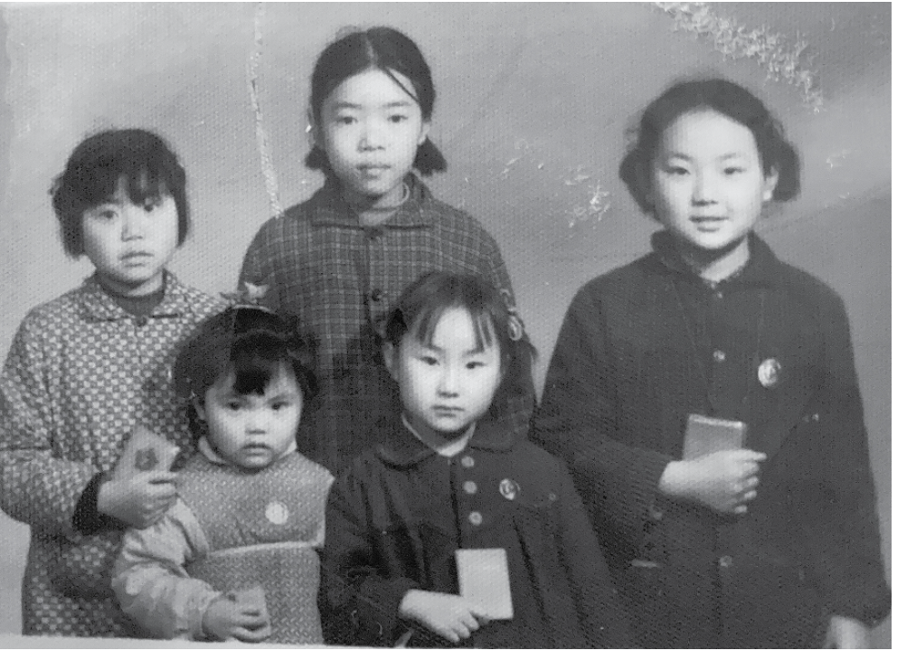

# 第二章：在毛统治的中国长大

每当我看到共产主义旗帜上的镰刀，我都会想到当年我那些受伤的小手指。

十岁时，我进入了五年级，当时正值文化大革命期间。我们被送往乡下一个月，与农民同住，帮助完成所谓的“双抢”（即抢收早季稻和插秧晚季稻）。这并不是简单的郊游，而是一次真实的劳动体验，这是毛主席的指示。

我第一次用镰刀割稻秆，像很多同学一样，手指多次被割伤。其中一名学生几乎把她的小指割断。

让我回溯一下。我在中国的童年生活分为两个截然不同的阶段：文化大革命前的生活和之后的生活。这种变化就像白天与黑夜，前者平静，后者混乱。

1966年文化大革命爆发时，我刚满六岁。对于我这个快七岁的孩子来说，事情发生的太突然了。我不太记得文化大革命前的日子，只记得那段时间很平静，像孩子应该有的生活。文化大革命是由毛泽东发起的一场政治运动，目的是清除中国共产党（CCP）和各级政府中的资本主义和资产阶级成分，以防社会主义的偏离。这场运动把整个中国都搅得天翻地覆。

作者（最右）和她的邻居朋友们（1969年4月，中国）

我出生在一个革命干部家庭，父母都是中共官员，类似于美国的公务员。他们年轻时怀着理想，加入了共产革命，追随中共描绘的愿景——“把被压迫者从压迫者的压迫中解放出来。”我们住在四川省的成都市。由于我父母是干部，我们被认为是特权阶层。我们能与四个家庭共用一个浴室和厕所，而许多人则需要共用整个居民楼的。我们五口之家有一间半的房间，而许多其他家庭几代同堂只能住在一间房间里。大家共用的厨房就一个小房间，里面摆着一个煤炉和一张小桌子。在我十六岁之前，这就是我的家。之后，我被送到农村，主要是从事农民的工作。

作者在天安门广场（1986年11月，在获得了她的美国签证后）

我成长时最大的幸运是，我没有像很多同胞那样经历饥饿。尽管我们家只有最基本的食物，但我仍被认为是吃得不错的。小时候，我总是渴望吃甜食。有一天，我在厨房的架子上看到一个像白糖的容器，难以置信地揉了揉眼睛。周围没人时，我搬来一把椅子，站上去抓住了那个容器，急不可待地舀了一大勺放进嘴里。想象一下，当我发现那其实是盐而不是糖时有多么惊讶！这件小事在我看来象征着共产主义——它充满了剥夺和欺骗，也许现在很多年轻的美国人无法理解这种感受。

由于父母的工作需要，他们常常不在家，于是把我送去寄宿学校，我每周六天都住在学校里。做寄宿生的感觉就像住在孤儿院里，但我依然觉得自己比很多人幸运。学校里有一位非常关心我的老师，学生们叫她黄老师。她是我的恩人。她很年轻，是新来的老师，而我们班是她在这所学校教的第一个班。她特别喜欢我，我也非常喜欢她，她像母亲一样照顾我。对于上课的内容我记得不多，但和她在一起的时光我记得很清楚。

周日，父母不能接我回家时，黄老师和她的新婚丈夫会带我去动物园或公园。这些是我在文化大革命风暴前的美好记忆，那场风暴很快改变了一切，使一切变得如此暴力。

1966年春天——那时我刚上小学一年级的第二个学期——文化大革命爆发了，学校立刻受到了冲击。我对文化大革命最早、最深刻的记忆之一就是学校食堂里突然出现的大幅海报（这是唯一一个可以张贴海报的室内高墙），批判老师和校方人员。这些海报被称为“大字报”，上面用很大的字和卡通式的画面描绘，从远处也能看得清楚。这些海报有意做得很大，以便造成威慑和恐吓效果，而且确实达到了这个目的。它们是当时的“社交媒体”。就像今天的社交媒体一样，任何人都可以张贴海报——当然，革命的目标除外。

我该如何描述我当时看到和感受到的？混乱、疯狂、恐惧和困惑。这究竟是怎么回事？！

我当时太小，无法完全理解这些海报的内容，但我能看出它们是在批评学校的老师和管理人员。我记得有一张海报，上面有很吸引人的插画，抨击一位穿着得体、穿高跟鞋的女老师。她因打扮得体被斥为“资产阶级”，这在毛的教导中是被鄙视和公开辱骂的。不久后，攻击变得更加激烈。有一天，我看到一群年龄较大的学生跟着这位老师，对她破口大骂。他们最终把她围住，向她吐口水。没多久，她全身都被吐满了口水。

我还记得我们学校的另一位老师和她的丈夫，他们因为无法生育，收养了一个女儿。为此，她被指责为压迫和剥削一个无助的孤儿。年长的学生们突击了她的家——她家只是在教师宿舍里的一个单间。他们不放过任何东西——不论是个人物品，还是他们的家。

在老师家被搜查之后，我记得看到他们收养的女儿在建筑物后角的公共厨房里。那个大约十岁的小女孩蹲在地上，无法控制地哭泣，头埋在双臂和双腿之间。她的妈妈被学生带走参加了一场批斗会（公开羞辱）。我很困惑，学生们声称要保护这个小女孩免受她父母的压迫，但事实上却让她伤心地哭了起来。在我寄宿学校生活期间，放学后经常见到这位老师的女儿，她看起来是一个快乐且被父母宠爱的孩子。这究竟发生了什么事？

有一天，我走进教室，看见黑板上写着：停课三天。我的老师写下了这条信息，但他显然不知道，这三天最终会变成近两年。学校没有发布任何正式的停课公告，事实上，因为所有学校管理人员都被撤职，学校根本无人运作。

没人对此做好准备，大家都很震惊。就如我说的，前一天还在正常上课，转眼间一切都乱了。我想，那天晚上我把学校的情况告诉了父母，他们才知道这件事。我不记得他们的反应了。大概反应不大，因为他们同样在忙于应付工作中的混乱。后来通过一些大孩子，我才知道学校将无限期关闭。实际上，直到1967年晚些时候，毛泽东的文化革命委员会才下令学校重新开课，口号是“在教室里继续革命”。

由于文化大革命的影响，学校关闭了，父母在工作中也忙于革命活动，无法监管孩子。这意味着他们要学习毛主席或中央文革小组的最新指示，进行自我批评看是否符合指示，还要在任何一天批斗那些被发现不合党路线的人。作为孩子，我们可以自由地在外面玩耍。这让我能近距离观察到文化大革命在街头上演的情景。我看到了很多批斗会，这种公众审判旨在羞辱和谴责被针对的个人。还有满载“人民敌人”的卡车游行，罪行写在他们胸前的大牌子上，头戴高高的纸锥帽。牌子上写着他们的名字，并划了一条线，好像象征着这些人的存在被抹去了。我只知道，他们一定是很坏的人，不然为什么红卫兵要当众点名让大家谴责他们呢？我在第六章专门探讨了红卫兵这个话题。总的来说，他们是一群被灌输思想并动员起来的青年，誓言要忠实执行毛主席的命令，推进文化大革命。

有一天，我和一个朋友在外面观看集会时，看到一队卡车驶来，车后座满了戴着大标牌和纸锥帽的男人。命运的安排下，卡车上竟有我朋友的父亲。他的标牌上名字被划掉，写上“小爬虫”，表示他是被批判党的领导人的追随者。我朋友看到她父亲受这样羞辱后，开始哭泣。那一刻，我突然意识到，这事情同样可能发生在我父亲身上，因为我父亲和她父亲一样，都是低级干部。我祈祷我父亲不要做错什么，不会被抓去游斗。

我在成都看到的情景，正在全国各地上演。红卫兵沿着整条街走过。几乎没有人能逃过红卫兵的迫害——甚至四川省省长李井泉也遭遇了批斗，我亲眼目睹。

最终，红卫兵因为派系争斗开始互相攻击，争相声明他们才是真正的毛泽东思想代表。暴力升级得如同内战。一天，我们吃晚饭时，一颗流弹击中了我们窗户下方。如果再高一点就会射进我们家，可能会造成严重伤害，甚至更糟。那时，我们开始在街上看到到到处贴着死者的照片，据说是被不同红卫兵派系杀害的人。我尤其记得一张海报上，照片显示一具被挖眼、破腹的尸体。这让我对这些惨状久不能忘，噩梦不断。

有一天，我们听到远处传来很大声的音乐。那音乐是一首中国的葬礼进行曲，十分阴森可怕。我们都停下手中的事情，朝那声音跑去。人群中传来消息，说这是一次尸体游行。尸体游行的目的是通过展示自己是受害者，来赢得公众的同情。当我靠近时，恐惧顿时涌上心头，我突然停了下来。我意识到，如果继续前进，我将看到终身难忘的恐怖景象。然而，我的想象力填补了未见的惨状，噩梦相伴。不幸的是，我的叔叔在那段时间死于癌症。因为红卫兵在医院太平间搜尸体，宣称那些尸体是被谋杀的同志，我母亲不得不帮我婶婶尽快安排火化他的遗体。

那些日子非常混乱，不仅是街头，家里也不平静。由于父母经常不在家，我承担起了照顾小我三岁的妹妹的任务。那时，我成了她的“母亲”，大部分时间我要照顾我们俩个人，直到1969年之后，情况才逐渐变好。而我的小弟弟则交由一对夫妇照看。

当学校终于在1967年底重新开学时，我被归为第一学期的四年级学生，仿佛没人注意到我们已经缺课很久了。这让我想起今天美国的孩子，他们不仅因 COVID 疫情受影响，更因为2020年大多数州政府制定的糟糕的学校关闭政策而失去了上课的机会。

我回到的学校已不再是文化大革命前的那个学校了。旧的教科书被禁止使用，但还没有新的教科书来代替它们。唯一提供的新教科书是一部毛泽东语录集，人们通常称之为《小红书》。所有的学术学习都被《小红书》取代。我们不仅要背诵毛泽东的语录，还要唱由这些语录组成的歌曲。

所有学术和任何形式的学习都被毛泽东的意识形态完全取代了。我必须承认，我是许多接受这种思想的学生之一。我们有什么选择呢？我当然不知道还有更好的选择。然而，有一句毛泽东的语录让我产生了疑问：“凡是敌人反对的，我们就要支持。凡是敌人支持的，我们就要反对。”我不禁想：“如果敌人喜欢吃糖，那我是不是应该讨厌它呢？”这些疑问一直都留在我脑海中，从未向任何人透露过。

在允许学校重新开放时，毛泽东宣称恢复教学是为了让我们可以在学校继续文化大革命，但这次是通过课堂上对他的书籍的“学习”。我几乎记得大部分的语录，至今还能唱那些歌，甚至能背诵毛泽东的诗。我尤其喜欢毛泽东诗中的一句话：“不许放屁。”

在课堂上，我们几乎每天都在学习和背诵毛泽东的语录和诗歌，我不禁记住了它们。时间一久，这些东西都深深地植入了我的脑海中。甚至父母之间也比着看谁的孩子能背诵更多的语录和诗歌。有一天，我父亲回家后说，他的同事的女儿比我小，却能毫无差错地背诵所有毛泽东的诗。他对我说：“你得更加努力才行。”

除了学习毛泽东的话语，我们还在课堂上举行批评和自我批评会，这是一种较温和的斗争会形式，学生们会利用从《毛主席语录》中学到的句子进行互动。批评包括对那些言行不“正确”的学生进行指责。自我批评则要求我们反省自己未能达到毛泽东教导的标准。这被称为“活学活用”。在学期结束时，我不止一次被选为班级的杰出活跃分子，因为我认真学习和运用毛泽东思想 —— 毛泽东版的马克思主义理论。

你可能想知道我从同学和老师那里受到过哪些批评。一个经常出现的批评是说我太骄傲，太自信了。这违背了毛泽东教导中的谦虚和低调原则。在方便的时候，我也会用这个进行自我批评，不然我就得找其他理由来批评自己。久而久之，学习会变得千篇一律，毫无新意。

后来，我们得到了改进版的数学教科书。这些新教科书与《小红书》并无太大区别。实际上，新教材就是《小红书》的化身，只是换成了数学、阅读等各个学科。我们的教育因此严重受限，只能培养出听话的、受毛泽东思想启发的机器人。

在我十年求学期间，我们没有学到太多知识。毛主席要求我们每学期花一个月参加“向工农兵学习”项目。我在田里收割稻谷，也在丝绸厂和食品罐头厂工作。有一次，我们在工厂里用锤子粉碎煤渣，回收未燃烧的部分。当然，没有任何防护装备。一块小碎片飞进我眼睛，疼痛难忍。我艰难地找到工厂诊所，却发现医生正与朋友聊天，我只能忍痛等待。这次经历让我体会到劳动的残酷。

我们还进行过军事训练，包括射击和长途徒步行军。甚至在学校里挖战壕，以防俄国修正主义帝国主义的入侵。战壕沿着操场的围墙延伸。我总是想，如果俄国人真的来了，我们能撤到哪里呢？

另一个重要活动是“忆苦思甜”。我们会收集可食用的野草，用粗玉米面做成馒头，并听老工人讲述他们在“解放”前的苦难生活。吃这些馒头是为了让我们记住过去的苦难，感恩毛主席带来的幸福生活。这些馒头味道很差，但贫苦家庭的学生还是会吃它们，以填饱肚子。

直到1974年，毛主席允许邓小平重新担任第一副总理，我们才恢复了真正的学术学习。但这种情况只是短暂的。在这段短暂的时间内，一种对于我们来说极其陌生的感觉——希望，开始在我们心中萌芽。我们从未想象过有机会参加高考。我和朋友们兴奋地讨论起一个我们从未谈论过的话题——长大后想做什么。那时我十五岁。一年后，毛主席认为邓小平是个“右派”，试图扭转文化大革命的“进步”，于是 1975 年邓小平被免职，他的政策也被否定。那个夏天，我刚高中毕业。

邓小平被清除后，我们的梦想也破灭了。高中的最后一年，上大学的希望破灭了。相反，我们面临着作为“上山下乡运动”一部分，被遣返回农村的命运。

这场运动是在文化大革命开始两年后发起的，要求大约一千六百万城市青年去乡村，一些甚至被派到偏远地区，在未开垦的土地上创造新农田。对大多数城市青年来说，这不仅仅是一个月的事情，可能是终生的。

这场大规模运动持续到1978年，毛主席去世两年后。我在农村劳作了整整三年（1975–1978）。我们与农民在田间一同“学习”的时间被称为“再教育”。这项工作在原始条件下进行，包括与混合动物和人类粪便的肥料一起工作，然后将其撒在田野里，没有任何保护措施。一天结束后，无论我怎么洗手，味道总也去不掉。最后我不得不把手用厚毛巾包起来做成“手套”以挡住恶臭，但吃饭时还是觉得恶心。

农村出生的农民生活在那里一辈子，他们每天从早到晚在田地间劳作。至少他们晚上回家时，有家里的长辈准备饭菜。但对“下乡”青年而言，一天的辛苦劳作后做饭是一项额外的负担。往往因为没能找到足够的树枝做燃料，最后只能吃半熟的米饭，且只是用盐调味。有时运气好，我会在田间找到一条鳗鱼或一只大青蛙来煮。

每年，所在的公社会评选出最优秀的“下乡”青年。我的一个朋友曾获得这个荣誉，我不得不承认我有点嫉妒，觉得自己不是那种能吃苦的人。我们用“吃苦精神”来形容这种个人品质。我在学习和应用毛泽东思想方面很优秀，但为什么在田间的辛苦劳作中，不能做到最好呢？我默默责备自己太过于资产阶级，缺乏朋友所拥有的真正的革命精神。

在父亲的一再催促下，我最终提交了入党申请。我知道，成为党员可能有助于我回到城市，但我也很害怕，因为我明白，唯一能证明自己的办法就是在我最不擅长的“吃苦耐劳”方面加倍努力。

被吸收为中共党员被视为一种荣誉和特权。只有被认为有良好前途的申请者才会收到党领导的回复，开始这个漫长的考验过程，包括解释动机、提供详细的个人简历和行动计划。遗憾的是，党领导显然认为我不是一个合格的工人，甚至没有给我任何回应。

下乡青年被分配到不同的生产队，分散在各个地方，因此赶集日是我们见面和重新联系的最佳机会。某一天，我遇到的那些男孩子非常坦率地告诉我，我们这个小圈子之外正在发生的事情。深入谈话后，他们透露说，他们偷偷通过藏匿的短波收音机收听英国广播公司（BBC）和美国之音（VOA）。这让我几乎无法接受，因为在文化大革命初期，这样的行为可能导致入狱甚至处决，而在那时，我可是个忠诚的信徒！

我吓得不知所措，以至于他们告诉我的信息我一点都不记得了！当我回去平静下来后，我拿出日记本，愤怒地写道这些男孩在走一条非常危险的道路。他们怎么可以不遵从毛主席和党的指示呢？

通常写日记是为了保持记忆清晰，并帮助自己度过艰难时期。但我写日记并不是这个原因。我父亲在当地的党宣传部门工作，是一名专业作家，他建议我每天写日记以不断提高我的写作技巧。他说当我回家时会检查我的写作，我们会一起纠正错误。在一篇日记中，我记下了某人说的一句我认为不正确的政治话语，并认为这是一句话反革命的话。

看到我的这段日记时，父亲的表情我从未见过。他一脸严肃地看着我，问我：“你为什么要写下这个？你打算举报他吗？”他警告我以后不要再这样做。像许多父母一样，父亲从未和我们谈论过政治。我对他在这些问题上的立场一无所知。这可能是因为许多孩子被教育去举报自己的父母，导致许多父母被关押甚至被处决！父亲对我说这些话令我十分震惊。这是我第一次真正理解了父亲的政治观点。我曾以为他是一个忠诚的党员，但事实上，他确实持有不同的看法。

除了艰苦的农民生活外，被送到农村最令人绝望的是我回到城市的希望渐渐消失。我已经放弃了获得大学学位和美好职业的梦想。只要能离开农村和那里的艰苦条件，回到我的城市成都，得到一份工作，我就会很高兴。

我必须承认，困在农村的一个好处是我们可以接触到被禁的书籍。在文化大革命期间，书籍被禁和焚毁，图书馆关闭。但有些书幸存了下来。在我读中学时，红卫兵的狂热平息后，这些幸存的书开始在孩子们之间流传。我从不知道这些书最初的主人是谁或它们来自何处，但只要能拿到它们，这些都不重要。我非常感激能从我那灰暗的世界逃入这些书的世界。我读了《一千零一夜》、《安徒生童话》、《鲁滨逊漂流记》、《格列佛游记》以及中国古典文学《西游记》和《三国演义》。每当我读完一本书，我都会把它传给另一个孩子，让他们也能学习、逃避、想象或欢笑。

幸运的是，某个与我一同下乡的青年带来了大量书籍。他的父亲曾是图书馆员，在图书馆藏书被毁前带回了很多书。从他那里，我读到了许多经典的法语、英语和俄语小说，还有《第三帝国的兴亡》。我记得被纳粹的暴行震惊，同时也庆幸自己没有生活在纳粹德国，而未察觉到自己其实也生活在极端的压迫之中。压迫成了我的常态。

尽管面对现实的残酷，我偶尔仍然会梦想将来能做一些更大的事。我梦想有一天能够作为中国代表团的翻译去阿尔巴尼亚工作。为什么选阿尔巴尼亚？因为在当时中国的三个盟友（阿尔巴尼亚、朝鲜和北越南）中，它是最具异国情调的国家。

我在农村的再教育确实教会了我一些东西。我第一次真正了解到社会主义是无效的。在公社里，土地是“集体”所有的，这实际上意味着没有人真正拥有土地。农民和下乡青年通过工作赚取“工分”，这些工分在收获时换取农产品。赚取工分有两种方式：一种按时间，一种按产量。每天早上，我们都会在团队集结点集合，领取当天的工作指示。例如，如果任务是收割土豆，工分是按收割土豆的重量来计算的。这激励大家争相努力，尽可能多地收割土豆。然而，如果任务是除草，没有人会觉得有竞争或动力去努力工作，我们就会懒懒散散地闲聊一整天。为什么会这样呢？因为没有激励措施。不管我们努力工作还是偷懒，得到的工分都是一样的，为什么要为了没有回报而付出额外的努力呢？生产队长每天都在催促我们继续工作。你看，在社会主义社会中，如果你无论做多做少都得到同样的回报，谁还愿意做额外的工作呢？

毛泽东于1976年去世，这标志着他的文化大革命的结束。当时我真的不知道这对我和我的生活意味着什么。我没觉得会有任何变化。我们的生活除了毛的方式外，我不知道还有别的路可以走。媒体上到处都是我们将永远追随毛的方向的宣传。感谢上帝，情况并没有这么糟糕。1977年，邓小平再次掌权，开放了中国对西方的门户，宣告文化大革命结束，并专注于改善中国经济。仅仅一年之内，大学和学院重新对能够通过入学考试的人开放。这让我非常兴奋。现在，我只需要通过考试就能上大学了。我再次相信我的梦想可能会实现，我有了真正的希望。

中国恢复高考是一个历史性事件，因为它为数以百万计在十年文化大革命期间被剥夺教育机会的年轻人打开了机会之窗。这也意味着我不仅要与1975年班的同学竞争，还要与1966年至1977年的数百万学生竞争！

在我的“十年学业”中，我几乎没学到多少东西。熟记毛的小红书对我没有任何帮助。此外，由于那些年在乡下做农民的工作，我忘记了那点学过的知识。我考试没通过。尽管我有机会去上一个职业药学学校，但我拒绝了。

我决心下次一定要通过考试，那就是1978年的考试。我必须通过。我的未来取决于此。通过考试将是我摆脱乡村生活的唯一途径。这一年也是共产党不再强迫高中毕业生下乡的一年。我不想被甩在后面！我鼓起所有的信心去和生产队的党支书交谈。我很高兴这么做了，因为党支书允许我在完成本季所有要求的工时后回成都准备高考。我非常兴奋。那一季我努力工作，主要是挖灌溉渠，以便党支书如果有人问起我时会给我一个好评。

通过一个我父母的朋友，我设法在成都最好的高中之一获得一个暂时名额（不是正式名额），以参加考试预备班。当我进入高中预备班时只有十九岁，而其他人都只有十六或十七岁。在那些从未在乡下干过一天活的年轻笑脸中，我显得格格不入。那时候我已经在田里工作了三年，这也是三年的学习损失。我决心不浪费这个重新开始生活的机会，所以我连续三个月日夜学习。

准备班结束了，我已经做了所有能做的学习。是时候回到公社的县城参加考试了。等待考试结果的几个月拖得很长。我心里一直七上八下。最后，我的母亲在她的工作单位收到了我的录取通知。妈妈马上跳上她的自行车，尽可能快地骑着她颤抖的腿回家报喜。就在三年前的1975年，她骑着自行车，颤抖的腿，思绪万千地骑着回家改变我的户口，从城市改为农村，把我送到乡下经历了一段痛苦的生活。那次，她的眼睛充满了泪水，心中充满了绝望；这次，她的眼睛闪着兴奋，心中充满了纯粹的喜悦。

这一切正在发生。我将去大学学习英语。那些年不断破灭的希望终于结束了。在十九岁时，我将上大学，并对未来充满了兴奋。我不知道这将引领我走向一个连在最狂野的梦想中都未曾想象过的新生活：美国。